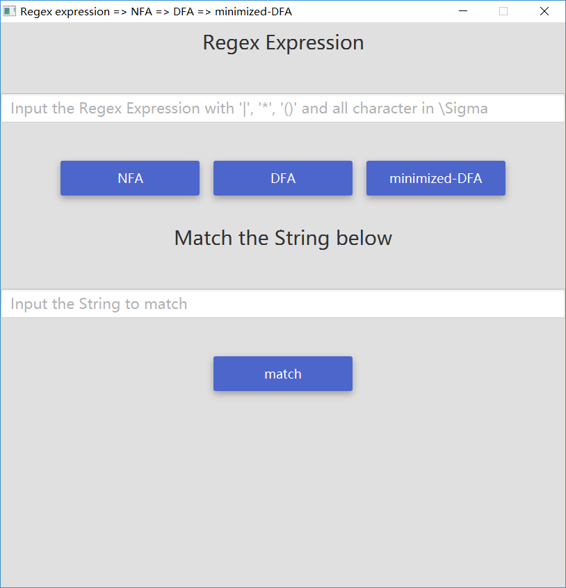
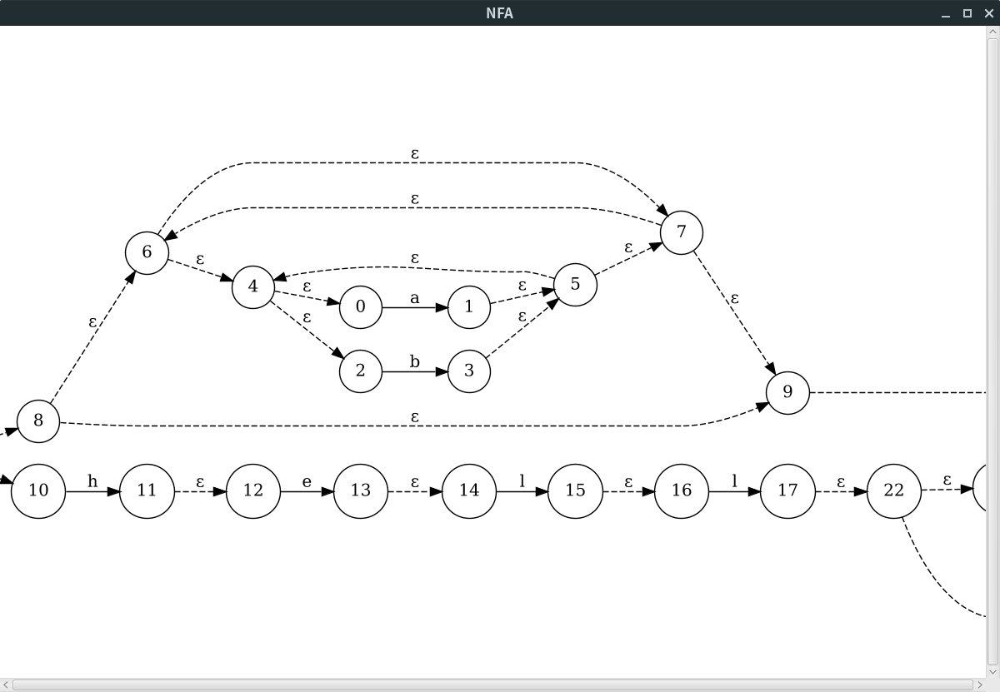
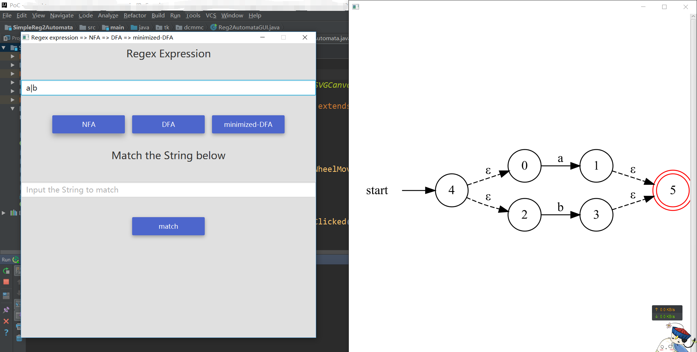
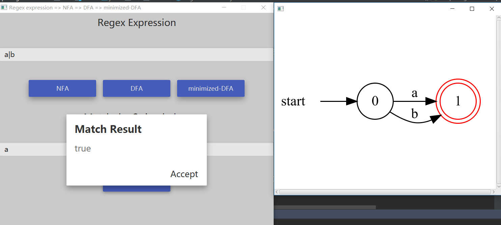

## Simple Regex expression to Automata (NFA/DFA)

### Introduction

A simple GUI program that can parse regex expression String (with only three basic operators) to e-NFA, tranform e-NFA to DFA and minimize DFA.

### Features

* parse regex expression to e-NFA using Dijkstra's Algorithm and McNaughton-Yamada-Thompson Algorithm.
* convert e-NFA to DFA using subset constructor Algorithm.
* minimize DFA
* simulate DFA
* view the state transition Graph
* output the png/svg/ps file
* an simple GUI using JavaFX and JFonix(Google Material Design)

### Screenshots









### Usage

This project is constructor using Gradle and Java10.

To run it in root directory of project:

```
$ ./gradlew run
```
**To use the project in IDEA**

```
$ ./gradlew idea
```
> 1.10 >= JDK Version >= 1.8


> My dev environment is ArchLinux(AMD64) and Oracle JDK10, so it may has some inconsistents in your environments.
> If you have trouble with it, please writer a issues to me :)

### TODOs

* 带鼠标事件的  JSVGCanvas

### Acknowledgments

* My Teacher
* JavaFX
* JFonix
* graphviz
* gesturefx
* Gragon Book 2nd
* Jetbrain 
